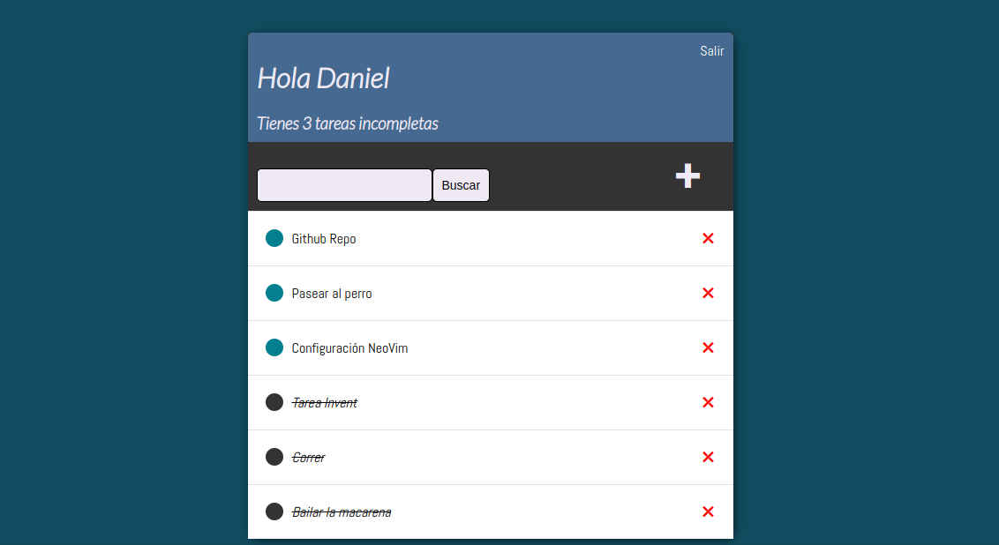

## Lista de tareas

Lista de tareas hecha en Django. Utiliza la propia autenticación de Django y permite crear, modificar, y borrar tareas con su correspondiente descriión y marcado de si está completa o no.

## Características

- Sistema de autenticación de Django con una interfaz diferente.
- Agregar, editar y eliminar tareas.
- Las tareas que se marcan como completas aparecen tachadas.
- Buscador de tareas.
